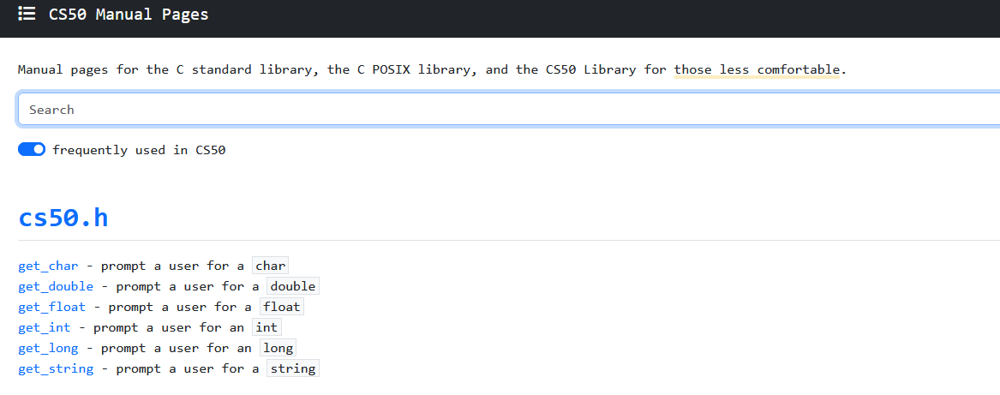

## Instructions and useful information

It is important to mention that the course is hosted in [here](https://learning.edx.org/course/course-v1:HarvardX+CS50+X/home)

#### Manual from CS50x that simplifies C's libraries for beginners and compares it with the official documentation.

Link: [https://manual.cs50.io/](https://manual.cs50.io/)
